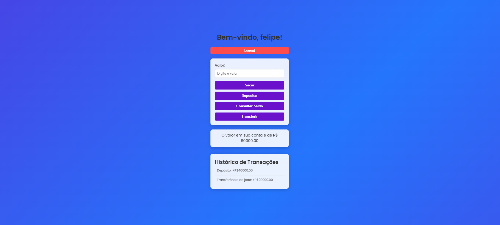

# Sistema Bancário Digital

  

## 📝 Descrição

O **Sistema Bancário Digital** é uma aplicação web que simula operações bancárias básicas, como criação de contas, login, depósitos, saques, transferências e consulta de saldo. Desenvolvido com **HTML**, **CSS** e **JavaScript**, o projeto tem como objetivo demonstrar habilidades em desenvolvimento front-end, lógica de programação e manipulação de dados em tempo real.

---

## 🚀 Funcionalidades

- **Criação de Usuários**:
  - Permite a criação de novas contas bancárias com nome de usuário e senha.
  - Verifica se o usuário já existe antes de criar uma nova conta.

- **Login e Logout**:
  - Autenticação simples para acessar a conta.
  - Botão de **Logout** para deslogar da conta atual e retornar à tela de login.

- **Operações Bancárias**:
  - **Depósito**: Adiciona fundos à conta do usuário.
  - **Saque**: Retira fundos da conta, desde que haja saldo suficiente.
  - **Transferência**: Transfere fundos para outra conta, com validação de saldo e existência do destinatário.
  - **Consulta de Saldo**: Exibe o saldo atual da conta.

- **Histórico de Transações**:
  - Registra todas as operações realizadas (depósitos, saques e transferências).
  - Exibe o histórico em uma lista organizada.

- **Interface Responsiva**:
  - Design moderno e responsivo, adaptado para diferentes tamanhos de tela (desktop, tablet e mobile).
  - Efeitos visuais, como gradientes animados e transições suaves.

---

## 🛠️ Tecnologias Utilizadas

- **HTML5**: Estruturação da interface.
- **CSS3**: Estilização e animações (gradientes animados, efeitos de hover, etc.).
- **JavaScript**: Lógica do sistema, manipulação de dados e interatividade.
- **Font Awesome**: Ícones para representar as operações bancárias.
- **Google Fonts**: Uso da fonte **Poppins** para um visual moderno e legível.

---

## ▶️ Como Executar o Projeto

Siga os passos abaixo para rodar o projeto localmente:

1. **Clone o repositório**:
   ```bash
   git clone https://github.com/seu-usuario/sistema-bancario.git